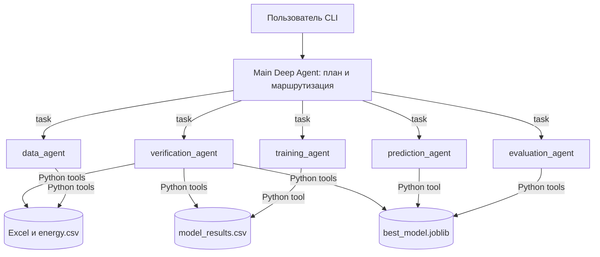

# Архитектура и роли

Тема проекта — оценка почасового спроса на электроэнергию в узлах сети Казахстана по опубликованному исследовательскому набору. Разделение на агентов нужно, чтобы доступ к инструментам соответствовал этапу работы: подготовка данных, обучение, анализ метрик, предсказание и независимая проверка имеют разные входы и критерии завершения. Оркестратор вызывает специалистов и не получает предметных Python tools. Математические расчёты выполняет код, а не LLM.

| Агент | Вход | Выход и критерий завершения | Инструменты |
|---|---|---|---|
| Main Deep Agent | Запрос пользователя; ответы специалистов | Ответ с путями и числами только из вызванных tools; запрошенные этапы распределены | `task` для подагентов |
| `data_agent` | Исходный Excel или `energy.csv`; вопрос о данных | Размер, признаки, target и качество данных либо пересозданный CSV | `load_dataset_tool`, `inspect_dataset_tool`, `prepare_dataset_tool` |
| `training_agent` | Подготовленный CSV | Результаты 11 моделей с 10-fold CV в `results/model_results.csv` | `train_and_evaluate_models_tool` |
| `evaluation_agent` | Сохранённая таблица CV | Лучший алгоритм по RMSE; полный обученный Pipeline | `create_results_table_tool`, `select_best_model_tool` |
| `prediction_agent` | `week`, `hour_in_week`, `node` | Числовой прогноз из сохранённого Pipeline либо ошибка проверки входа | `predict_energy_consumption_tool` |
| `verification_agent` | CSV, таблица, Pipeline | JSON с результатами независимых проверок `passed` | `verify_dataset_tool`, `verify_results_tool` |

Поручение оркестратора передаётся типизированным вызовом Deep Agents `task(subagent_type, description)`: тип подагента находится в отдельном поле, описание задачи — текст. Python tools возвращают JSON с именованными полями; ответы агентов оркестратору остаются текстовыми, поэтому окончательные числа перепроверяются tools. Формат свободного текста `description` нельзя считать жёсткой JSON-схемой.

Состояние диалога находится в `InMemorySaver` и связывается одним `thread_id` в течение работы CLI. После перезапуска CLI оно очищается. Данные, метрики и модель сохраняются отдельно в файлах. `results/agent_runs/*.jsonl` содержит время, агента, тип события, имя инструмента и статус; текст запросов, ответы tools и API-ключи не записываются. Соседний `.summary.json` содержит число вызовов LLM и инструментов каждого агента и их долю. Для требования ≤40% учитываются события `llm_call` и `tool_call` одного полного сценария. Отдельный короткий вопрос одному специалисту закономерно даёт долю выше 40%, поэтому мерить нужно заранее описанный типовой полный сценарий.

Фактический прогон полного сценария сохранён в [sample_run.jsonl](sample_run.jsonl) и [sample_run_summary.json](sample_run_summary.json): 30 вызовов, максимум у оркестратора — 11/30 = 36,7%. Это измерение одного типового прогона, а не гарантия одинаковой доли для любого запроса.

Ограничения: 50 шагов графа на запрос, 45 секунд и до двух повторов для одного запроса к модели, 180 секунд для процесса обучения, 300 секунд для полного запроса (проверка на каждом событии потока). Исключения логируются по типу, пользователю показывается путь к журналу. Лимит 300 секунд может быть превышен на длительность текущего ограниченного вызова модели или инструмента. Файловые/командные tools Deep Agents и стандартный универсальный подагент отключены профилем; у главного агента остаётся маршрутизация.

Источники и инструменты: опубликованный Excel и подготовленный CSV, выполнение Python/ML кода, сохранённый Pipeline и API выбранной LLM. Узловые значения исходного набора частично рассчитаны авторами; это ограничивает перенос результатов на реальные будущие периоды.
